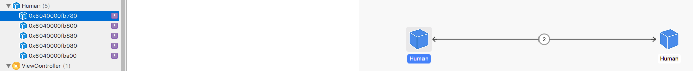

How is memory management handled on iOS?
========================================
요즘의 애플리케이션들은 메모리 관리가 매우 중요합니다. 특히 iOS 앱은 메모리와 다른 하드웨어 및 시스템의 제약이 있어서 더욱 그러하죠. 이런 이유로  여러가지 유형으로 묻는 질문 중 하나입니다. ARC, MRC, Reference Type, Value Type 등이 있습니다. 
* * *

## ARC
- 스위프트의 Auto Reference Count 는 Objective-C 의 그것과 같은 컨셉으로 동작합니다. (컴파일 타임에 레퍼런스 카운팅을 끝내고 객체들의 life time 을 정해 놓는다. 가비지 컬렉터는 런타임시에 사용하지 않는 객체를 추적 관리)
[ARC vs CG](https://medium.com/computed-comparisons/garbage-collection-vs-automatic-reference-counting-a420bd4c7c81)

- ARC 는 참조 타입의 인스턴스가 메모리(heap 또는 stack)에 생성된 순간부터 해당 인스턴스에 대한 강한 참조를 추적하여, 해당 인스턴스가 변수/상수/프로퍼티에 할당되거나 해제될때 카운트를 증가시키거나 감소시킵니다. 해당 인스턴스의 레퍼런스 카운트가 0 으로 떨어져서 더 이상 해당 인스턴스에 대한 참조가 없다고 판단될 때 메모리에서 해제됩니다. 

- ARC 는 값 타입에 대해서는 레퍼런스 카운트를 증가시키거나 감소시키지 않습니다. 값 타입의 인스턴스는 변수/상수/프로퍼티에 할당될 때 복사본이 전달되기 때문입니다.

- 강한 참조 사이클이 생성되면 해당 사이클에 들어 온 인스턴스들은 메모리가 해제되지 않아 메모리 leak 이 발생합니다. 예를 들어 아래의 코드는 사람이 배우자를 만나 연예를 하고 결혼하여 아이를 낳는 일생을 축약한 것인데요 덜덜덜 어쨌든 결혼을 하면 서로 속박하면서 절대로 떨어지지 않게 됩니다. 뭐 어떻게 보면 집착이라고도 할 수 있겠죠... combine(::) 함수를 보면 combine 성공시 서로를 강한 참조 사이클로 묶어 버립니다. 덕분에 해당 Human 구현체의 인스턴스들은 메모리에서 해제되지 않는 불상사가 생기게 됩니다. 실제로 문제가 되는것을 눈으로 확인할 수 있는데요. 앱을 실행한 후 좌측 네비게이터의 디버그 세션에서 디버그 메모리 그래프 버튼을 누르면 아주 깔끔하게 메모리 leak 이 발생한 것을 확인할 수 있습니다.

버튼은 숨어있으니 잘 찾으셔야 합니다 >..<


이런 식으로 확인이 가능합니다.



``` swift
/// [e] 성별: 남성, 여성
enum Gender: Int {
    case male = 0, female, neuter, unknown
}

/// [p] 이름을 가질 수 있는 타입을 위한 프로토콜
protocol Named {
    /// 학명
    var scientificName: String {get}
    /// 이름
    var name: String {get set}
    /// 별명
    var alias: String {get set}
}

/// [e] 서식지: 땅, 물, 공기중
enum Habitat: String {
    case soil, water, air
}

/// [p] 동물을 가리키는 프로토콜
protocol Animal {
    var age: Int {get}
    /// 서식지
    var habitat: Habitat {get set}
    /// 서식지 이동
    mutating func movement(from: Habitat, to: Habitat) -> Bool
}

/// [p] 생식이 가능한 타입을 위한 프로토콜
protocol Reproductable {
    /// 생식 활동을 위한 클로저 선언
    typealias ReproductiveActivity = (Reproductable) -> Reproductable?
    /// 성별
    var gender: Gender {get set}
    /// 교미
    static func mate(_ closer: Reproductable) -> ReproductiveActivity
}

/// [p] 호모 사피엔스를 가리키는 프로토콜. Animal, Named, Reproductable 을 준수해야 함
class HomoSapiens: Animal, Named, Reproductable {
    var gender: Gender
    var age: Int
    var name: String
    var alias: String
    lazy var scientificName: String = {
        return "\(self.name) Homo Sapiens -> child of Lucy(Australopithecus afarensis: The First Upright Walker)"
    }()
    
    /// 호모 사피엔스는 땅에서 서식합니다.
    var habitat: Habitat = {
        return Habitat.soil
    }()
    
    /// 함께 살아가는 영장류
    var attatched: HomoSapiens? {
        didSet {
            if attatched == nil {
                print("[attatched is gone]")
            }
        }
    }
    /// combine 을 거부할 수 있는 횟수
    var resistanceCount: Int = -1
    
    /// 이름, 별명, 나이, 성별을 정해줍니다.
    init(name: String, alias: String, age: Int, gender: Gender) {
        print("HomoSapiens is appear")
        self.name = name
        self.alias = alias
        self.age = age
        self.gender = gender
        switch self.gender {
        case .male:
            self.resistanceCount = 0
        case .female:
            self.resistanceCount = 3
        default:
            self.resistanceCount = -1
        }
        print(String(describing: self).components(separatedBy: ".").last!)
    }
    
    /// 다른 호모 사피엔스를 attatch 하기 위한 행위
    func combine(_ homoSapiens: HomoSapiens) -> (Bool, Int) {
        guard homoSapiens.attatched == nil else {
            // 이미 딸린 식구가 있으면 낭패
            return (false, homoSapiens.resistanceCount)
        }
        
        // 상대가 튕기면 낭패
        guard homoSapiens.resistanceCount <= 0 else {
            if homoSapiens.resistanceCount > 0 {
                homoSapiens.resistanceCount -= 1
            }
            if resistanceCount > 0 {
                resistanceCount -= 1
            }
            print("\(self).resistanceCount: \(resistanceCount)")
            print("\(homoSapiens).resistanceCount: \(homoSapiens.resistanceCount)")
            return (false, homoSapiens.resistanceCount)
        }
        // 결합 완료
        homoSapiens.attatched = self
        attatched = homoSapiens
        print("\(#function) success")
        return (true, homoSapiens.resistanceCount)
    }
    
    /// 짝짓기를 합니다.
    @discardableResult
    static func mate(_ closer: Reproductable) -> Reproductable.ReproductiveActivity {
        return {
            guard let sender = closer as? HomoSapiens, let receiver = $0 as? HomoSapiens, sender.gender != receiver.gender else {
                return nil
            }
            guard sender.gender != .neuter, sender.gender != .unknown, receiver.gender != .neuter, receiver.gender != .unknown else {
                let child = Human(name: "unknown: Extraorindinary Phenomenon;", age: 0, gender: .unknown)
                return child
            }
            let child = ((sender.name.count / 2) + receiver.name.count) % 2 == 0 ?
                Human(name:"girl > child of HomoSapiens;", age: 0, gender: .female) :
                Human(name:"boy > child of HomoSapiens;", age: 0, gender: .male)
            return child
        }
    }
    
    /// 여행을 떠나요~
    @discardableResult
    func movement(from: Habitat, to: Habitat) -> Bool {
        print("\(#function) from: \(from.rawValue), to: \(to.rawValue)")
        guard from == self.habitat else {
            return false
        }
        self.habitat = to
        return true
    }
    
    deinit {
        print("[\(name) is gone]")
    }
    
}
extension HomoSapiens: Hashable {
    var hashValue: Int {
        return name.hashValue ^ age.hashValue ^ gender.hashValue ^ habitat.hashValue
    }
}
extension HomoSapiens: Equatable {
    static func ==(lhs: HomoSapiens, rhs: HomoSapiens) -> Bool {
        return lhs.hashValue == rhs.hashValue
    }
}

extension HomoSapiens: CustomDebugStringConvertible {
    var debugDescription: String {
        var desc = "name: \(name), attatched: "
        if attatched != nil {
            desc += "\(attatched!.name)\n"
        } else {
            desc += "no\n"
        }
        
        return desc
    }
}

/// 현대의 사람을 가리킴
class Human: HomoSapiens {
    convenience init(name: String, age: Int, gender: Gender, attatched: HomoSapiens? = nil) {
        self.init(name: name, alias: "HomoSapiens", age: age, gender: gender)
        self.alias = (self.gender == Gender.male) ? "Man" : "Woman"
        self.attatched = attatched
        // 배우자가 있는 경우 서로를 이어주고
        guard let glued = self.attatched else {
            return
        }
        glued.attatched = self
        glued.resistanceCount = 0
        resistanceCount = 0
    }
    
    deinit {
        print("Human is gone")
    }
}

func testHuman() {
    var humans = [Human?]()
    var headly: Human? = Human(name: "Headly", age: 56, gender: .female, attatched: nil)
    var malkovich: Human? = Human(name: "Malkovich", age: 65, gender: .male, attatched: headly)
    var childOfMH: Human? = (HomoSapiens.mate(malkovich!)(headly!) as! Human)
    childOfMH!.name = "Header"
    print("childOfMH: \(childOfMH!)")
    print()
    humans.append(headly)
    humans.append(malkovich)
    humans.append(childOfMH)
    
    var jane: Human? = Human(name: "Jane", age: 22, gender: .female, attatched: nil)
    var jackson: Human? = Human(name: "Jackson", age: 25, gender: .male, attatched: jane)
    var childOfJJ: Human? = (HomoSapiens.mate(jackson!)(jane!) as! Human)
    childOfJJ!.name = "Judy"
    print("childOfJJ: \(childOfJJ!)")
    print()
    humans.append(jane)
    humans.append(jackson)
    humans.append(childOfJJ)
    
    if childOfMH!.gender != childOfJJ!.gender {
        while childOfMH!.combine(childOfMH!).1 > 0 {
            print(childOfMH!.combine(childOfMH!))
        }
        var childOfMHJJ: Human? = (HomoSapiens.mate(childOfMH!)(childOfJJ!) as! Human)
        childOfMHJJ!.name = "Micheal"
        print(childOfMHJJ!)
        humans.append(childOfMHJJ)
    }
    
    var flatMappedHuman: [Human]? = humans.flatMap{ $0! }
    print("print all humans")
    flatMappedHuman!.forEach{ print("\($0)\n") }
    
    flatMappedHuman!.remove(at: flatMappedHuman!.index(of: headly!)!)
//    headly!.happened(to: headly!)
    headly = nil
    flatMappedHuman!.remove(at: flatMappedHuman!.index(of: jackson!)!)
//    jackson!.happened(to: jackson!)
    jackson = nil
    print("headly, jackson was removed")
    print("print all humans")
    flatMappedHuman!.forEach{ print("\($0)\n") }
    
    flatMappedHuman!.removeAll()
    flatMappedHuman = nil
}
```

- 이런 강한 참조를 해결하는 방법은 2가지가 있습니다. attatched 프로퍼티를 약한 참조인 `weak var attatched: Human?` 으로 변경해야 하거나, 미소유 참조인 `unowned var attatched: Human` 으로 변경하면 됩니다.

- weak 는 레퍼런스 카운팅을 하지 않겠다는 뜻이고, 해당 프로퍼티에 할당된 인스턴스의 레퍼런스 카운트가 0 으로 떨어지면 자동으로 nil 처리되기 때문에 var 이어야 하고 또한 옵셔널이어야 합니다. 

- unowned 도 레퍼런스 카운팅을 하지 않겠다는 것은 같지만 weak 와 반대로 절대로 옵셔널이면 안됩니다. 그래서 var/let 어떤 식으로 선언해도 상관이 없습니다. 해당 프로퍼티에 할당된 인스턴스의 레퍼런스 카운트가 0 으로 떨어지더라도 자동으로 nil 처리되지는 않습니다. 그렇기 때문에 참조하고 있던 인스턴스가 메모리에서 해제된 이후 다시 해당 프로퍼티에 접근하면 nil 객체 참조로 인해 앱이 종료됩니다. 즉 참조할 인스턴스가 절대로 nil 이 되지 않는다는 확신이 있는 경우에만 사용을 고려해 볼 수 있습니다.

- 이 외에도 강한 참조 사이클은 참조 타입인 클로저에서도 발생할 수 있습니다. 클로저가 참조 타입의 프로퍼티인 경우 해당 클로저 안에서 인스턴스를 강한 참조하기 때문인데요. 이를 방지하기 위해 클로저에는 캡쳐 리스트라는 것을 제공하여 참조 타입을 결정하는 규칙을 적용시킬 수 있습니다. 아래에서 badCase 메서드는 closure 에서 강한 참조 사이클에 빠지는 예제이고, badCase2 메서드는 캡쳐 리스트를 사용하기는 했으나 self 의 참조 타입을 unowned 로 변경하여 SomeClass 의 인스턴스가 nil 이 된 이후 해당 closure 가 호출되는 경우에 대한 예제이며, goodCase 메서드는 캠쳐 리스트로 self 참조 타입을 weak 로 변경하여 앞의 2가지 문제를 해결하는 예제입니다.

``` swift
typealias SomeClosure = (Int, Int) -> Int
class SomeClass {
    var a: Int = 1, b: Int = 2
    var anotherClass:AnotherClass
    func badCase() {
        // capture list 를 사용하지 않는 경우 강한 참조 사이클에 빠집니다.
        let badClosure: SomeClosure = {
            print("badClosure")
            return self.a + self.b + $0 + $1
        }
        anotherClass.doSomething(badClosure)
    }
    
    func badCase2() {
        // capture list 에서 unowned 를 사용할 경우 해당 클로저가 실제로 사용되는 순간에 self 가 nil 이 아니라는
        // 보장이 없으므로 앱이 강제 종료될 수 있으므로 사용을 지양하는 편이 좋습니다.
        let badClosure: SomeClosure = { [unowned self] in
            print("badClosure")
            return self.a + self.b + $0 + $1
        }
        anotherClass.doSomething(badClosure)
    }
    
    func goodCase() {
        // capture list 를 사용한 경우 강한 참조 사이클에 빠지지 않습니다.
        // 그리고 weak 로 받은 this 에 대한 guard let 바인딩을 통해 nil 인지 확인하기 때문에
        // 앱이 강제 종료되지 않고도 다른 작업을 수행할 수 있습니다.
        let goodClosure: SomeClosure = { [weak this = self] in
            // 당장은 번거로워 보이지만 이 클로저가 언제 어디에서 호출되어 강제 종료가 발생할지 모르니 
            // 이렇게 처리 하는게 정신 건강에 좋습니다.
            guard let this = this else {
                print("have no closure's owner")
                return $0 + $1
            }
            return this.a + this.b + $0 + $1
        }
        anotherClass.doSomething(goodClosure)
    }
    
    init(another: AnotherClass) {
        self.anotherClass = another
    }
}

class AnotherClass {
    var todo: SomeClosure?
    func doSomething(_ closure:@escaping SomeClosure) {
        todo = closure
    }
    func execution() {
        print(todo!(3, 4)) // 10
    }
}

struct Test {
    enum Case {
        case strong, unowned, weak
    }
    
    private var testCase: Case?
    private var someClass: SomeClass?
    private var anotherClass: AnotherClass?
    
    init() {
        anotherClass = AnotherClass()
        someClass = SomeClass(another: anotherClass!)
    }
    
    mutating func execute(_ testCase: Case) {
        self.testCase = testCase
        switch self.testCase! {
        case .strong:
            testStrong()
        case .unowned:
            testUnowned()
        case .weak:
            testWeak()
        }
    }
    
    mutating private func makeNilAndCallClosure() {
        print("someClass = nil")
        if self.testCase! != .weak {
            someClass = nil
        }
        anotherClass!.execution()
        
        print("call execution")
        if self.testCase! == .weak {
            someClass = nil
        }
        anotherClass!.execution()
        anotherClass = nil
    }
    
    mutating private func testStrong() {
        someClass!.badCase()
        makeNilAndCallClosure()
    }
    
    mutating private func testUnowned() {
        someClass!.badCase2()
        makeNilAndCallClosure()
    }
    
    mutating private func testWeak() {
        someClass!.goodCase()
        makeNilAndCallClosure()
    }
}

func testClosure() {
    var test = Test()
    // 강한 순환 사이클
    test.execute(.strong)
//    강제 종료 발생
//    test.execute(.unowned)
//    정상 동작
//    test.execute(.weak)
}
```

- 연산 프로퍼티에 클로저를 할당한 경우 해당 프로퍼티를 초기화하고 나면 해당 클로저는 사라지기 때문에 당연히 @noescape 이고 내부에서 사용하는 self 는 캡쳐시 unowned 로 동작합니다. 위의 HomoSapiense 의 scientificName 처럼 말이죠.


