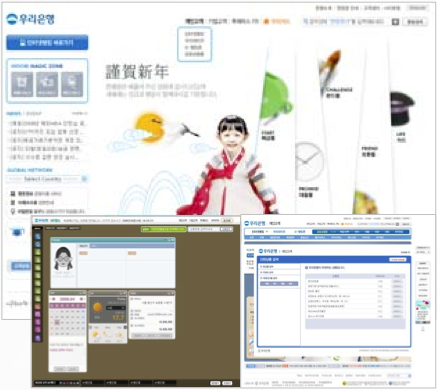
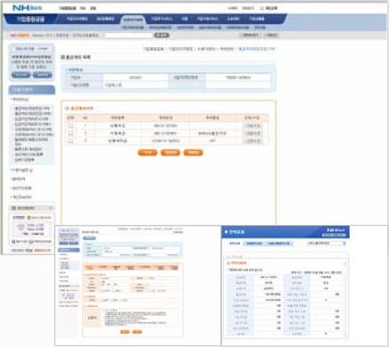
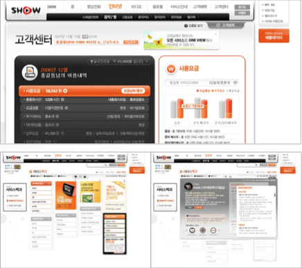

## profile
<table>
<tr>
     <td rowspan="3">
          
     </td>
     <td valign="top">
          <table>
               <tr>
                    <!-- <td> 이름: </td> -->
                    <td> 이태훈 </td>
               </tr>
               <tr>
                    <!-- <td> 생년월일: </td> -->
                    <td> 1981년 2월 18일생 </td>
               </tr>
               <tr>
                    <!-- <td> e-mail: </td> -->
                    <td> bankart0218@gmail.com </td>
               </tr>
          </table>
     </td>
</tr>
</table>

## objective
 플래시로 개발 입문하여 지금은 iOS 개발자가 되어 있는 9년차 개발자입니다. 플래시 개발자로 시작해서 frame by frame 애니매이션을 이용한 E-Learing 컨텐츠도 만들어 보고, 통신사 포털 및 은행 뱅킹 서비스도 조금이지만 경험해 보았습니다. 하지만 iPod Touch 를 사용해본 후 모바일 애플리케이션에 매료되어 iOS 개발자로 전향했습니다. 

 전향 후 첫 프로젝트로 문제가 생긴 우체국 우편 서비스 애플리케이션을 수정하여 앱스토어에 올리면서 자신감을 얻었습니다. 이후 일본에서 서비스 예정이었던 증권 애플리케이션을 개발하면서 당시 SBI 증권 본사로 한달간 지원 근무를 하며 조금이지만 해외에서의 근무도 경험 했습니다. 마지막으로 근무했던 회사에서는 모바일 카메라에 원격으로 접속하여 카메라 각도 조작 및 저장된 영상을 확인하는 프로젝트에 참여했습니다. 장기간 개발 및 유지보수 하며 Objective-C 에서 Swift 로 개발 언어가 변경되고 프로젝트 전체를 마이그레이션하는 경험을 했습니다. 그리고 잠시 진행하다 말았지만 hybrid 애플리케이션으로 변경하기 위해 html, javascript, css, angular-js 로 prototype 을  배포하기도 했습니다. 

 이렇게 다양한 경험으로 경력과 함께 피로도 쌓여 작년 초 충전의 시간을 갖고자 퇴사 후 여행을 하며 휴식을 취했습니다. 현재는 충전 후 뭔가 생활에 보탬이 될 만한 서비스를 만들어보고 싶어 최신 swift 를 공부하면서 개인 프로젝트를 구상하고 있습니다.

## skills
 - swift, objective-c, angularJS, javascript, css, html, actionScript, flex
 - etc: Subversion, Git, cocoapod

## career
 - 네이버시스템(주) iOS 개발자 
    - Wisenet SmartCam 애플리케이션 개발
    - 삼성 멀티캠퍼스 인터넷 강의 애플리케이션 개발

 - Jubilee Korea iOS 개발자
     - 일본 SBI(SoftBank Investment) 의 주가 조회 애플리케이션 개발 

 - 엠텍소프트 iOS 개발자
     - 우체국 쇼핑 우편 서비스, 다이어리 애플리케이션 개발

 - 엑스프라임(주) flash/flex 개발자
     - 통신사 웹사이트, 은행 개인/기업 뱅킹, 모바일 플래시 개발

 - 디자인 큐브 flash 개발자
     - 삼성, SK, 웅진 등 사내 교육용 E-Learning 컨텐츠 개발

## project
 ### company
 - Wisenet SmartCam 
     - Objective-C, Swift 사용하여 B2C 카메라 애플리케이션 개발 및 유지 보수
     - 스마트캠 링크 
     [구버전](https://itunes.apple.com/kr/app/wisenet-smartcam/id1131139819?mt=8) 
     , [신버전](https://itunes.apple.com/kr/app/wisenet-smartcam/id1209296174?mt=8)

     - 전반적인 UI 구조 설계 및 로그인, 카메라 등록/삭제, 녹화영상 조회/삭제, HTTP/IPC 통신을 담당
     - cocoapod 사용하여 Snapkit, CocoaLumberjack, AsyncSwift 등 오픈소스 사용
     - 잠시 'one source' 정책이 시행되어 전체 기능을 라이브러리로 묶고 UI 는 제공되는 AngularJS 템플릿을 커스터마이징하여 개발

 - 삼성 CIC
     - 멀티캠퍼스 수강생들을 위한 인터넷 강의 애플리케이션 개발
     - 구현되어 있는 미디어 플레이어를 제외한 전체 기능 개발

 - Hyper SBI
     - Objective-C 사용하여 일본 주식 관련 정보를 조회하는 애플리케이션 개발
     - 전체 구조 refactoring, 주식 조회 화면 일부 담당

 - Share Note
     - Objective-C 사용하여 테마를 다운 받아 변경할 수 있는 다이어리 애플리케이션 개발

     <!--  -->

 - 우체국
     - Objective-C 사용하여 우체국 애플리케이션 개발
     - 우체국 애플리케이션 내부 메뉴중 POST Shop 내 나만의 우표, 우표, 축하카드 서비스 담당
     - [앱 링크](https://itunes.apple.com/kr/app/%EC%9A%B0%EC%B2%B4%EA%B5%AD/id435940000?mt=8)

 - XIE(Xprime Image Editor)
     - actionscript, flex, javascript 사용하여 유지 보수 및 refactoring

     <!--  -->

 - 은행
     - actionscript, flex, frame by frame animation, javascript, sqlite 사용
     - 우리은행: 개인 이체

     

     - 농협: 기업회원 정보 조회

     

     - 외환은행: CRM Tool Demo
     - 신한은행: 상품몰 도우미 플래시

 - 통신사 사이트
     - actionscript, javascript 사용
     - LG Oz: 메시징 센터

     

     - KT Show: 회원 정보 조회/수정 담당

     

### indivisual
 - Elder81
     - Objective-C 사용하여 친구들과의 tweet, dm 만 보여주는 기능을 하는 애플리케이션 개발

     

 
 - MissingKr
     - Objective-C 사용하여 twitter 를 이용해 실종된 사람 및 분실물에 대한 특정 태깅을 기반으로 정보를 공유하는 애플리케이션 개발
     - tweet 에 위치정보 포함시 카메라를 사용하여 현 위치를 기준으로 해당 위치에 marking 표시하여 보여주는 기능 제공
     - KT App Fair 출품

     

 

