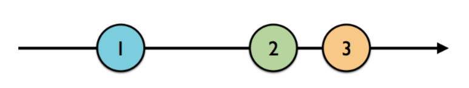
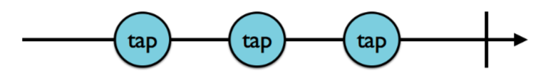
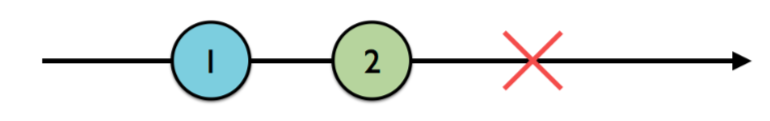

# Chapter 2: Observable

### Observable 이란?
- Observable, Observable Sequence, Sequence 등의 단어가 Rx 에서 동일한 뜻으로 사용되는 것을 볼 수 있습니다. 실제로 모두 같은 뜻이며, 종종 다른 언어 개발자가 "Stream" 이라고 표현하지만(같은 의미이긴 합니다.) RxSwift 에서는 Sequence 라고 합니다. 

- Observable 은 특별한 능력이 있는 시퀀스입니다. 그중 가장 중요한 것은 비동기적이라는 것입니다. Observable 은 일정 시간동안 발생하는 이벤트를 참조하는 프로세스라고 할 수 있습니다. 이벤트는 number 또는 커스텀 타입의 인스턴스를 값으로 담고 있거나 tap 과 같이 인식된 gesture 를 담고 있을 수 있습니다.

- 이것을 가장 잘 이해할 수 있는 방법중 하나는 marble 다이어그램을 이용하는 것입니다.

<br>

- 왼쪽에서 오른쪽으로 표시된 화살표는 시간을 나타냅니다. 그리고 숫자는 시퀀스의 요소를 나타냅니다. 1번 부터 순차적으로 발생된 것을 표현한 것이지만 어느정도의 시간이 흘렀는지는 알 수 없습니다. Observable 의 생명주기 어느 시점에서나 발생할 수 있기때문이죠.


### Observable 의 생명주기
- Observable 이 원소를 발생시키면 next 이벤트로 동일한 원소가 발생됩니다.

- 아래의 marble 다이어그램은 위의 다이어그램과 다르게 오른쪽 끝에 관찰이 끝남을 표시하는 세로바가 있습니다.

<br>

- 위의 observable 은 3 번의 tap 이벤트를 발생시킨 후 종료됩니다. 종료되었으므로 이것을 completed 이벤트라고 부릅니다. 위의 다이어그램은 예를 들자면, tap 한 view 가 dismiss 되었을 수도 있습니다. 중요한 것은 observable 이 종료되었고, 더이상 이벤트를 발생시키지 않는다는 점입니다. 이 경우는 일반적인 종료상황이라고 할 수 있습니다. 반대로 아래의 다이어그램과 같이 뭔가 잘못되는 경우도 있을 수 있습니다.

<br>

- 위의 다이어그램은 에러가 발생한 경우입니다. 붉은색 x 표시로 에러가 발생했음을 알 수 있죠. observable 은 에러를 담고있는 error 이벤트를 발생시킵니다. 정상적으로 종료된 complete 이벤트와는 다릅니다. error 이벤트를 발생시킨 경우에도 observable 은 종료되고 더이상 이벤트를 발생시키지 않습니다.


### Quick Recap
- observable 은 원소를 담고있는 next 이벤트를 발생시킵니다. error 이벤트가 발생되어 종료되거나, complete 이벤트가 발생되어 종료될 때까지 지속될 수 있습니다.

- observable 이 종료되면 더이상 이벤트가 발생되지 않습니다.

``` swift
public enum Event<Element> {
	case next(Element)
	case error(Swift.Error)
	case completed
}
```

- 위의 예와같이 RxSwift 에서 Event 는 enumeration 의 case 로 표현됩니다. .next 는 Element 의 인스턴스를 담고있고, .error 는 Swift.Error 를 담고 있지만 completed 는 아무것도 담지 않고 이벤트를 종료시킵니다.

``` swift
let one = 1, two = 2, three = 3
// 단 하나의 원소만 포함하는 observable 을 생성할 때는 Observable 의 type 함수인 just 함수를 사용합니다.
let observable: Observable<Int> = Observable<Int>.just(one)
// Rx 의 함수들은 operators 로 간주됩니다. 위에서는 하나의 원소만 포함하는 operator 였다면 
// 아래는 여러개의 원소를 포함하는 observable 을 생성하는 예입니다.
let observable2 = Observable.of(one, two, three)
```

- 여러개의 Int 를 지정하기 때문에 observable2 는 [Observable<Int>] 라고 생각할 수 있지만 추론된 유형을 확인해보면 Observable<Int> 입니다. playground 파일에서 Option + click 하여 확인해보세요. api 를 확인해보면 Observable.of(_ elements: Int..., scheduler: ImmediateSchedulerType = default) -> Observable<Int> 로 되어 있고, elements 는 갯수가 정해지지 않은 파라미터로 정의되어 있습니다.(variadic parameter) 로 정의되어 있습니다.

- 만약 observable 배열을 생성하고 싶다면 `let observable2 = Observable.of([one, two, three])` 처럼 사용하면 됩니다. 물론 just operator 도 파라미터를 배열로 전달해도 됩니다. 좀 이상하지만 배열 하나만 전달되므로 결국 배열이라는 단 하나의 원소만 포함하는 observable 을 생성하게 됩니다.

- 그 외에 from operator 를 사용해서 observable 을 생성할 수 있습니다. 사용예는 아래와 같습니다.
``` swift
let observable4 = Observable.from([one, two, three])
```

- from operator 는 배열의 원소들로부터 개별 유형의 인스턴스를 생성합니다. from operator 는 파라미터로 배열만 전달받습니다.


### observable 구독하기
- iOS 개발자라면 NSNotificationCenter 에 익숙할 수도 있을겁니다. observer 에게 RxSwift 의 observable 과는 다른 notification 을 broadcast 합니다. 아래는 키보드 프레임 변경에 대한 notification 을 제어하는 예제입니다.

``` swift
let observer = NotificationCenter.default.addObserver(
	forName: .UIKeyboardDidChangeFrame,
	object: nil,
	queue: nil
) { notification in
    // handle receiving notification
}
```

- RxSwift 의 observable 을 구독하는 것은 addObserver() 대신 subscribe() 를 사용하면 됩니다. 개발자들이 흔히 NotificationCenter.default 싱글턴 인스턴스를 사용하지만 Rx 의 observable 은 각각 다 다른 객체입니다.

- 더 중요한 것은 observable 은 subscriber 를 가지기 전까지 이벤트를 발생시키지 않는다는 점입니다. observable 의 실체는 시퀀스라는 것을 기억하십시오. observable 을 구독하는 것은 swift standard library 의 Iterator 에서 next() 함수를 호출하는 것과 같습니다.

``` swift
let sequence = 0..<3
var iterator = sequence.makeIterator()
while let n = iterator.next() {
	print(n)
	/*
	0
	1
	2
	*/
}
```

- observable 을 구독하는 것은 위의 예제보다 더 간단합니다. observable 이 발생하는 이벤트마다 다른 핸들러를 추가할 수도 있습니다. 

``` swift
let one = 1, two = 2, three = 3
let observable = Observable.of(one, two, three)

// trailing closure 를 사용하여 간단히 구독할 수 있습니다.(모든 이벤트가 출력됩니다.)
observable.subscribe {
	print(event)
}
/*
next(1)
next(2)
next(3)
completed
*/


// event 는 optional 인 element 를 가지고 있어서 값을 추출하여 사용해야 합니다.(element 가 있는 경우에만 출력됩니다.)
observable.subscribe { event in
    if let element = event.element {
        print(element)
    }
}
/*
 1 2 3
 */


// .next 이벤트를 명시적으로 구독하여 내부 element 에 보다 쉽게 접근할 수 있습니다.(다른 이벤트는 무시합니다.)
observable.subscribe(onNext: { element in
   print(element)
)
*
1 2 3
*/


// 비어있는 observable 도 생성할 수 있습니다. 타입을 추론할 수 없는 경우 특정 타입 유형으로 정의해줘야 하는데 empty 인 경우 Void 가 적절합니다.
// 즉시 종료되는 observable 을 return 하고 싶거나, 비어있는 observable 을 의도적으로 만들고싶을 때 사용할 수 있습니다.
// 구독하고 싶은 이벤트를 명시적으로 전달해줘야 해당 이벤트를 제어할 수 있습니다.
let observable = Observable<Void>.empty()
observable
.subscribe(
    onNext: { element in
        print(element)
},
    onCompleted: {
        print("completed")
})
/*
 completed
 */


// .never operator 는 empty 와 달리 아무것도 발생시키지 않고, 절대 종료되지도 않는 observable 을 만들 수 있습니다.
// 아래 예제는 아무것도 출력되지 않습니다. 그렇다면 동작하는지는 어떻게 알 수 있을까요? Challenge section 에서 살펴보겠습니다.
let observable = Observable<Any>.never()
observable
.subscribe(
    onNext: { element in
        print(element)
},
    onCompleted: {
        print("completed")
})

```

- 지금까지는 명시적으로 변수에 담아둔 observable 로 작업했지만 다양한 범위의 값에서 observable 을 생성할 수도 있습니다.

``` swift
// .range operator 로 start 값 부터 count 개의 원소를 가지는 순차적인 observable 을 생성합니다.
let observable = Observable<Int>.range(start: 1, count: 10)
observable
.subscribe( onNext: { i in
	// n 번째까지의 피보나치 수열을 출력합니다.
	let n = Double(i)
	let fibonacci = Int(((pow(1.61803, n) - pow(0.61803, n)) / 2.23606).rounded())
	print(fibonacci)
})
```

- 피보나치 수열을 구하는 코드를 구하는 더 좋은 방법이 있으나 그건 chapter 7 "Transforming Operators" 에서 배우도록 하겠습니다.


### Disposing and terminating
- observable 은 구독되기 전까지 아무것도 하지 않는다는 것을 기억하세요. 구독하는 행위가 트리거가 되어 .error, .completed 이벤트가 발생되어 종료되기 전까지 이벤트를 발생시킵니다. 구독을 취소하여 observable 을 종료시킬 수도 있습니다.

``` swift
let observable = Observable.of("A", "B", "C")
// observable 을 구독하면 Disposable 이 반환되어 subscription 변수에 저장됩니다.
let subscription = observable.subscribe { event in print(event) }
```

- 명시적으로 구독을 종료하려면 `subscription.dispose()` dispose() 를 호출하면 observable 은 이벤트 발생을 멈춥니다.

- subscription 을 관리하는 것이 지루하다면 DisposeBag 타입을 사용하면 됩니다. dispose bag 은 disposables(.disposed(by:) 를 사용하여 추가된) 을 보관합니다. 그리고 dispose bag 이 메모리에서 해제될 때, 각 disposable 의 dispose() 를 호출합니다. 

``` swift
// dispose bag 생성
let disposeBag = DisposeBag()
// observable 생성 후 구독(이벤트 발생시 element 출력) 및 반환된 disposable 의
// dispose(by:) 를 사용하여 disposeBag 에 보관시킵니다.
Observable.of("A", "B", "C")
.subscribe {
	print($0)
}
.dispose(by: disposeBag)
```

- 위와 같은 패턴을 가장 많이 사용하게 될텐데, observable 생성 및 구독 후 즉시 dispose bag 에 담는 행위는 직접 수동으로 disposable 을 관리하여 메모리 누수가 발생하는 것을 방지해주기 때문이죠.(혹시 수동으로 관리하더라도 구독후 반환되는 disposable 을 사용하지 않았다면 컴파일러가 경고를 띄우기 때문에 걱정하지 않아도 되긴 합니다.)


