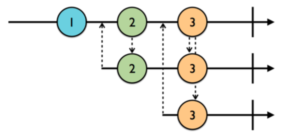

# Chapter 3: Subjects

- 지금까지 observable 을 어떻게 만들고, 구독하고, 작업이 완료됐을 때 어떻게 처리하는지 등에 대해 배웠습니다. observable 은 RxSwift 의 아주 기본적인 부분이지만 애플리케이션 개발시 일반적으로 새로운 값을 런타임에 수동으로 observable 로 감싸고 subscribers 로 방출해야하는 일이 필요하므로 꼭 알아야 하는 부분이죠. 그런데 우리가 원하는 것은 observable 이면서 observer 의 역할을 동시에 수행할 수 있는 녀석입니다. 그런 녀석을 subject 라고 부릅니다.


### Getting started

- 아래의 예제에서 알 수 있듯이 타입의 이름이 아주 적절합니다. 왜냐하면 신문 발행자와 비슷하게 정보를 전달받고 아마도 구독자들에게 전달하기 전 정보를 수정하고 구독자에게 출판하기 때문입니다. 

``` swift
// 생성된 subject 는 String 타입이기 때문에 문자열만 출판할 수 있습니다. 초기화 된 후 뭔가 수신할 수 있습니다. 
let subject = PublishSubject<String>()
// 아래와 같이 코드를 작성하면 subject 에 새로운 문자열을 추가할 수 있습니다. 하지만 아직 아무것도 출력되지 않습니다.
// 아직 observer 가 없기 때문이죠
subject.onNext("Is anyone listening?")

// 이전 챕터의 마지막에서 했던 것과 같은 방식으로 .next 이벤트 에서 string 을 출력하는 subscription 을 생성했습니다. 
// 하지만 여전히 아무것도 출력되지 않습니다. 곧 다양한 주제들을 공부하며 알아보겠습니다.
let subscriptionOne = subject
.subscribe(onNext: { string in 
	print(string) 
})
```

- 위의 예제에서 일어나는 일은 PublishSubject 가 현재의 subscriber 에게만 방출된다는 것입니다. 그렇기 때문에 subscribe 되기 전에 무언가 추가되었다면, 해당 값을 얻어올 수 없습니다. 

- 위이 예제 마지막에 `subject.on(.next("1"))` 를 추가하면 "1" 이라는 문자열이 출력됩니다. subscribe operator 와 동일한 형식으로 on(.next(:)) 으로 새로운 .next 이벤트를 subject 에 추가할 수 있습니다. 축약형식으로 `subject.onNext("2")` 이렇게 사용해도 됩니다.


### What are subjects?

- Subjects 는 observable 과 observer 의 역할을 모두 수행할 수 있습니다. 위에서 subject 가 어떻게 이벤트를 수신하고 구독하는지 알아봤습니다. .next 이벤트들을 수신하고, 이벤트를 수신할 때마다 구독자에게 방출합니다.

- RxSwift 에 있는 4개의 subject 타입들에 대해 알아봅시다.
    - PublishSubject: 비어 있는 채로 시작되고 subscribers 에 새로운 원소만 방출합니다.
    - BehaviorSubject: 초기값을 가지고 시작되고 새 원소 또는 최신 원소를 새로운 subscribers 로 재생합니다. [Q. *재생한다는 의미는?*]
    - ReplaySubject: 버퍼 사이즈를 가진채로 초기화되고 사이즈만큼 원소를 포함하여 유지될 수 있으며 새로운 subscribers 로 재생합니다.
    - Variable: BehaviorSubject 를 감싼 것입니다. 현재 값의 상태를 유지하고 최신 또는 초기 값만 새로운 subscribers 로 재생합니다.


### Working with publish subjects
- 간단하게 subscribe 된 시점부터 unsubscribe 되거나 .completed, .error 이벤트로 종료될 때까지 subscribers 에게 새로운 이벤트를 알려주기 원한다면 Publish subject 를 사용할 수 있습니다.

- 아래 marble 다이어그램을 보면, 가장 윗 라인은 publish subject 이고, 두 번째, 세 번째 라인은 subscribers 입니다. 위로 향하는 화살표는 구독을 나타내며, 아래로 향하는 화살표는 이벤트들의 방출을 표현합니다.

<br>

- 첫 번째 subscriber 는 1번 marble 이후에 구독을 합니다. 그래서 1번 marble 로부터 이벤트를 수신하지 못하고, 2 ~ 3번 marble 에 대해서 수신할 수 있습니다. 그런 이유로 두 번째 subscriber 는 2번 marble 이후인 3번 marble 에 대해서만 이벤트를 수신할 수 있습니다.

- 위의 예제에 아래의 코드를 추가해 봅니다.

``` swift
// .next 이벤트로 방출된 이벤트는 optional 원소를 포함하기 때문에 nil-coalescing 연산자를 사용하여 
// 원소에 값이 있으면 출력하고 없으면 이벤트를 출력합니다.
let subscriptionTwo = subject
.subscribe { event in 
    print("2)", event.element ?? event)
}

// subscriptionTwo 를 생성한다고 해도 아무것도 출력되지 않습니다. 아래의 코드를 추가하면 그제서야 출력이 됩니다.
subject.on(.next("3"))
/*
1
2
3
2) 3
*/

// subscriptionOne 을 처리하고
subscriptionOne.dispose()

// 이벤트를 추가하면 
/*
1
2
3
2) 3
4
2) 4
로 출력되지 않고

1
2
3
2) 3
2) 4
로 출력됩니다. 당연하게도 subscriptionOne 이 disposed 되었기 때문이죠
*/
subject.on(.next("4"))
```

- publish subject 가 정지 이벤트로 알려진 .completed, .error 이벤트를 수신하면 새로운 subscribers 에게 .next 이벤트는 더이상 방출되지 않고, stop 이벤트만 방출됩니다. 그러나 향후 구독하는 subscribers 에게 stop 이벤트는 다시 방출됩니다. 위의 예제에 코드를 추가해 봅시다.

``` swift
// subject 에 .completed 이벤트를 넣습니다. 편의 연산자인 on(.completed) 를 사용해도 됩니다. 
// 이 방법은 효과적으로 observable 시퀀스를 종료시킬 수 있습니다.
subject.onCompleted()

// subject 에 새로운 원소를 추가합니다. subject 가 종료되었으므로 방출되지 않아서 출력되지 않습니다.
subject.onNext("5")

// 구독 종료 후 처리하는 것을 잊지 마세요~
subscriptionTwo.dispose()

let disposeBag = DisposeBag()
// 새로운 구독을 생성하고 바로 disposeBag 에 추가합니다.
subject
.subscribe {
	print("3)", $0.element ?? $0)
}
.disposed(by: disposeBag)
subject.onNext("?")

// .completed 이벤트로 subject 가 종료되었으므로 그 이후에 추가된 원소 5, ? 는 출력되지 않습니다.
// 하지만 종료되었다는 이벤트는 수신되어 2), 3) 에 completed 가 출력됩니다.

/*
1
2
3
2) 3
2) 4
2) completed
3) completed
*/
```

- 사실 모든 subject 타입은 한번 종료되면 향후 subscribers 에게 stop 이벤트만 다시 방출합니다. 종료시 뿐만 아니라 이벤트가 이미 종료된 이후에도 알림을 받는 것이 좋기 때문에 stop 이벤트 핸들러를 코드에 포함시키는 것은 좋은 아이디어 입니다.

- 온라인 입찰 애플리케이션 같은 시간에 민감한 데이터를 모델링할 때 publish subject 를 사용할 수 있습니다. 10시 1분에 합류한 사용자에게 9시 59분에 경매가 1분 밖에 남지 않았다고 경고하는 것은 말이 안되죠.

- 가끔 우리는 새로운 subscribers 에게 구독 이전에 이미 방출된 원소를 알려주고 싶은 경우가 있습니다. 이를 위한 몇 가지 옵션이 준비되어 있습니다.


### Working with behavior subjects
- behavior subjects 는 최신 .next 이벤트를 재생하는 것을 제외하곤 publish subjects 와 비슷하게 동작합니다.


