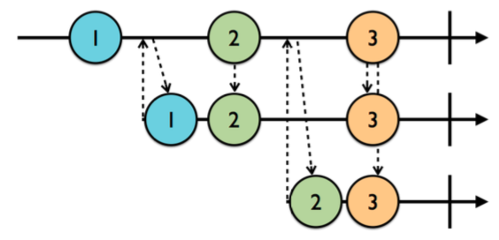
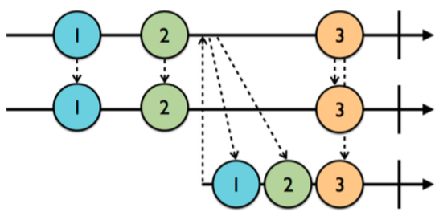

# Chapter 3: Subjects

- 지금까지 observable 을 어떻게 만들고, 구독하고, 작업이 완료됐을 때 어떻게 처리하는지 등에 대해 배웠습니다. observable 은 RxSwift 의 아주 기본적인 부분이지만 애플리케이션 개발시 일반적으로 새로운 값을 런타임에 수동으로 observable 로 감싸고 subscribers 로 방출해야하는 일이 필요하므로 꼭 알아야 하는 부분이죠. 그런데 우리가 원하는 것은 observable 이면서 observer 의 역할을 동시에 수행할 수 있는 녀석입니다. 그런 녀석을 subject 라고 부릅니다.


### Getting started

- 아래의 예제에서 알 수 있듯이 타입의 이름이 아주 적절합니다. 왜냐하면 신문 발행자와 비슷하게 정보를 전달받고 아마도 구독자들에게 전달하기 전 정보를 수정하고 구독자에게 출판하기 때문입니다. 

``` swift
// 생성된 subject 는 String 타입이기 때문에 문자열만 출판할 수 있습니다. 초기화 된 후 뭔가 수신할 수 있습니다. 
let subject = PublishSubject<String>()
// 아래와 같이 코드를 작성하면 subject 에 새로운 문자열을 추가할 수 있습니다. 하지만 아직 아무것도 출력되지 않습니다.
// 아직 observer 가 없기 때문이죠
subject.onNext("Is anyone listening?")

// 이전 챕터의 마지막에서 했던 것과 같은 방식으로 .next 이벤트 에서 string 을 출력하는 subscription 을 생성했습니다. 
// 하지만 여전히 아무것도 출력되지 않습니다. 곧 다양한 주제들을 공부하며 알아보겠습니다.
let subscriptionOne = subject
.subscribe(onNext: { string in 
	print(string) 
})
```

- 위의 예제에서 일어나는 일은 PublishSubject 가 현재의 subscriber 에게만 방출된다는 것입니다. 그렇기 때문에 subscribe 되기 전에 무언가 추가되었다면, 해당 값을 얻어올 수 없습니다. 

- 위 예제 마지막에 `subject.on(.next("1"))` 를 추가하면 "1" 이라는 문자열이 출력됩니다. subscribe operator 와 동일한 형식으로 on(.next(:)) 으로 새로운 .next 이벤트를 subject 에 추가할 수 있습니다. 축약형식으로 `subject.onNext("2")` 이렇게 사용해도 됩니다.


### What are subjects?

- Subjects 는 observable 과 observer 의 역할을 모두 수행할 수 있습니다. 위에서 subject 가 어떻게 이벤트를 수신하고 구독하는지 알아봤습니다. .next 이벤트들을 수신하고, 이벤트를 수신할 때마다 구독자에게 방출합니다.

- RxSwift 에 있는 4개의 subject 타입들에 대해 알아봅시다.
    - PublishSubject: 비어 있는 채로 시작되고 subscribers 에 새로운 요소만 방출합니다.
    - BehaviorSubject: 초기값을 가지고 시작되고 새 요소 또는 최신 요소를 새로운 subscribers 로 replay 합니다.
    - ReplaySubject: 버퍼 사이즈를 가진채로 초기화되고 사이즈만큼 요소를 포함하여 유지될 수 있으며 새로운 subscribers 로 replay 합니다.
    - Variable: BehaviorSubject 를 감싼 것입니다. 현재 값의 상태를 유지하고 최신 또는 초기 값만 새로운 subscribers 로 replay 합니다.


### Working with publish subjects
- 간단하게 subscribe 된 시점부터 unsubscribe 되거나 .completed, .error 이벤트로 종료될 때까지 subscribers 에게 새로운 이벤트를 알려주기 원한다면 Publish subject 를 사용할 수 있습니다.

- 아래 marble 다이어그램을 보면, 가장 윗 라인은 publish subject 이고, 두 번째, 세 번째 라인은 subscribers 입니다. 위로 향하는 화살표는 구독을 나타내며, 아래로 향하는 화살표는 이벤트들의 방출을 표현합니다.

<br>

- 첫 번째 subscriber 는 1번 marble 이후에 구독을 합니다. 그래서 1번 marble 로부터 이벤트를 수신하지 못하고, 2 ~ 3번 marble 에 대해서 수신할 수 있습니다. 그런 이유로 두 번째 subscriber 는 2번 marble 이후인 3번 marble 에 대해서만 이벤트를 수신할 수 있습니다.

- 위의 예제에 아래의 코드를 추가해 봅니다.

``` swift
// .next 이벤트로 방출된 이벤트는 optional 요소를 포함하기 때문에 nil-coalescing 연산자를 사용하여 
// 요소에 값이 있으면 출력하고 없으면 이벤트를 출력합니다.
let subscriptionTwo = subject
.subscribe { event in 
    print("2)", event.element ?? event)
}

// subscriptionTwo 를 생성한다고 해도 아무것도 출력되지 않습니다. 아래의 코드를 추가하면 그제서야 출력이 됩니다.
subject.on(.next("3"))
/*
1, 2, 3, 2) 3
*/

// subscriptionOne 을 처리하고
subscriptionOne.dispose()

// 이벤트를 추가하면 
/*
1, 2, 3, 2) 3, 4, 2) 4
로 출력되지 않고

1, 2, 3, 2) 3, 2) 4
로 출력됩니다. 당연하게도 subscriptionOne 이 disposed 되었기 때문이죠
*/
subject.on(.next("4"))
```

- publish subject 가 정지 이벤트로 알려진 .completed, .error 이벤트를 수신하면 새로운 subscribers 에게 .next 이벤트는 더이상 방출되지 않고, stop 이벤트만 방출됩니다. 그러나 향후 구독하는 subscribers 에게 stop 이벤트는 다시 방출됩니다. 위의 예제에 코드를 추가해 봅시다.

``` swift
// subject 에 .completed 이벤트를 넣습니다. 편의 연산자인 on(.completed) 를 사용해도 됩니다. 
// 이 방법은 효과적으로 observable 시퀀스를 종료시킬 수 있습니다.
subject.onCompleted()

// subject 에 새로운 요소를 추가합니다. subject 가 종료되었으므로 방출되지 않아서 출력되지 않습니다.
subject.onNext("5")

// 구독 종료 후 처리하는 것을 잊지 마세요~
subscriptionTwo.dispose()

let disposeBag = DisposeBag()
// 새로운 구독을 생성하고 바로 disposeBag 에 추가합니다.
subject
.subscribe {
	print("3)", $0.element ?? $0)
}
.disposed(by: disposeBag)
subject.onNext("?")

// .completed 이벤트로 subject 가 종료되었으므로 그 이후에 추가된 요소 5, ? 는 출력되지 않습니다.
// 하지만 종료되었다는 이벤트는 수신되어 2), 3) 에 completed 가 출력됩니다.

/*
1, 2, 3, 2) 3, 2) 4, 2) completed, 3) completed
*/
```

- 사실 모든 subject 타입은 한번 종료되면 향후 subscribers 에게 stop 이벤트만 다시 방출합니다. 종료시 뿐만 아니라 이벤트가 이미 종료된 이후에도 알림을 받는 것이 좋기 때문에 stop 이벤트 핸들러를 코드에 포함시키는 것은 좋은 아이디어 입니다.

- 온라인 입찰 애플리케이션 같은 시간에 민감한 데이터를 모델링할 때 publish subject 를 사용할 수 있습니다. 10시 1분에 합류한 사용자에게 9시 59분에 경매가 1분 밖에 남지 않았다고 경고하는 것은 말이 안되죠.

- 가끔 우리는 새로운 subscribers 에게 구독 이전에 이미 방출된 요소를 알려주고 싶은 경우가 있습니다. 이를 위한 몇 가지 옵션이 준비되어 있습니다.


### Working with behavior subjects
- behavior subjects 는 최신 .next 이벤트를 replay 하는 것을 제외하곤 publish subjects 와 비슷하게 동작합니다.

<br>

- 위의 marble 다이어그램을 보면 첫 번째 라인이 subject 입니다. 첫 번째 subscriber 는 두 번째 라인 1번 subject 다음, 2번 subject 전에 구독을 시작합니다. 그렇기 때문에 구독 즉시 1번 subject 에 대해 전달받고 이후 2, 3번 subject 가 방출되면 순서대로 전달받습니다. 이와 같은 방식으로 두 번째 subscriber 는 2번 subject 다음, 3번 subject 전에 구독하여 2번 subject 에 대해서 즉시 전달받고, 그 이후 방출되는 subjects 에 대해 순서대로 전달받습니다.

``` swift
enum MyError: error {
	case anError
}

// event 를 편하게 출력하기 위한 메서드입니다.
func print<T: CustomStringConvertible>(label: String, event: Event<T>) {
	print(label, event.element ?? event.error ?? event)
}

// BehaviorSubject 는 항상 최신 값을 방출하기 때문에 초기값이 필요합니다.
// 만약 초기값이 필요없다면 PublishSubject 를 사용해야합니다.
let subject = BehaviorSubject(value: "Initial value")
let disposeBag = DisposeBag()

subject
.subscribe {
	print("1)", $0)
}
.dispose(by: disposeBag)

/*
1) Initial value
*/
```

- 위의 예제를 보면 subject 가 초기값을 가지고 생성된 이후 구독되었습니다. 이후 다른 요소가 추가되지 않았으므로 최신값인 초기값이 subscriber 에게 재생됩니다.

- 위의 예제에서 구독 전에 `subject.onNext("X")` 를 추가하면 "1) Initial value" 대신 "1) X" 가 출력됩니다. "X" 가 최신값이기 때문이죠.

- 위의 예제 마지막 부분에 다음과 같은 코드를 추가하면서 어떻게 출력될지 생각해봅시다.

``` swift
subject.onError(MyError.anError)
subject
.subscribe {
	print("2)", $0)
}
.dispose(by: disposeBag)

/*
1) X, 1) anError, 2) anError
*/
```

- .error 이벤트가 각 구독마다 한 번씩 2번 출력되는 것을 확인하셨나요? BehaviorSubject 는 UI 를 가장 최신 데이터로 미리 채워야하는 경우 유용하게 사용될 수 있습니다. 예를 들면, 사용자 프로필 화면의 control 을 behavior subject 에 바인딩하여 애플리케이션이 새로운 데이터를 가져오는 동안 최신값을 보여줄 수 있습니다. 검색 화면처럼 여러개의 아이템을 보여줘야하는 등 최신값 보다 더 많은 것이 필요하다면 어떻게 하냐구요? 이제 곧 배우게 될 것입니다.


### Working with replay subjects
- Replay subjects 는 지정된 크기까지 방출하는 최신 요소들을 일시적으로 캐시하거나 또는 버퍼링합니다. 그 다음 버퍼를 새 subscriber 에게 재생합니다. 

- 아래의 marble 다이어그램은 버퍼 사이즈 2의 replay subject 를 표현하고 있습니다. 중간 라인의 첫 번째 subscriber 는 이미 구독한 상태라서 첫 번째 라인의 요소들이 방출될 때마다 전달받고 있습니다. 마지막 라인의 두 번째 subscriber 는 2번 원소 이후 구독했지만 1, 2번 원소를 다시 재생받습니다.

<br>

- replay subject 를 사용할 때마다 버퍼가 메모리를 점유하고 있다는 것을 유념하세요. 각각의 인스턴스가 이미지와 같이 많은 메모리를 차지하는 몇몇 타입의 replay subject 에 대해서는 명확하게 버퍼 사이즈를 설정해야만 합니다. 또 주의해야 할 것은 여러 요소를 가지는 배열을 replay subject 로 만드는 경우입니다. 방출된 각 요소들은 배열이 됩니다. 그래서 설정한 버퍼 사이즈만큼 많은 배열이 버퍼링되죠. 그렇기 때문에 조심하지 않으면 이 과정에서 메모리 압박이 생기기 쉽습니다.

``` swift
// 버퍼 사이즈 2인 replay subject 를 생성합니다.
let subject = ReplaySubject<String>.create(bufferSize: 2)
let disposeBag = DisposeBag()

// 3개의 요소를 추가합니다.
subject.onNext("1")
subject.onNext("2")
subject.onNext("3")

// 2개의 구독을 생성합니다.
subject
.subscribe {
	print(label: "1)", event: $0)
}
.dispose(by: disposeBag)

subject
.subscribe {
	print(label: "2)", event: $0)
}
.dispose(by: disposeBag)

// 여기까지 작성 후 실행하면, 버퍼 사이즈가 2이기 때문에 1은 출력되지 않고 2, 3 만 replay 되어 출력됩니다.
/*
1) 2, 1) 3, 2) 2, 2) 3
*/


// 새로운 요소를 추가합니다.
subject.onNext("4")
subject
.subscribe {
	print(label: "3)", event: $0)
}
.dispose(by: disposeBag)

// 이전 구독의 경우 이미 2, 3 을 replay 했기 때문에 새로 추가된 4 만 출력하고, 
// 새로 추가된 구독은 마지막 2개의 요소에 대해 replay 되어 출력됩니다.
/*
1) 4, 2) 4, 3) 3, 3) 4
*/
```

- 위의 예제에서 4번 요소를 추가한 직후 `subject.onError(MyError.anError)` 코드를 추가하한 후 실행하면 결과는 아래와 같습니다.

``` swift
1) 4, 2) 4, 1) anError, 2) anError
3) 3, 3) 4, 3) anError
```

- replay subject 는 .error 이벤트로 종료되며, 이미 확인했듯이 이 오류는 새로운 subscriber 로 다시 방출됩니다. 하지만 버퍼도 그대로 남아있기 때문에 stop 이벤트가 다시 방출되기 전에 새로운 subscriber 로 버퍼에 담긴 원소들도 replay 됩니다.

- error 를 추가한 다음 `subject.dispose()` 를 추가하여 실행하면 아래와 같이 출력됩니다. 사전에 replay subject 에 명시적으로 dispose() 를 호출하면 새로운 subscriber 는 subject 가 이미 처리되었음을 나타내는 .error 이벤트만 전달받습니다.

``` swift
3) Object 'RxSwift.ReplayMany<Swift.String>' was already disposed.
// ReplayMany 는 ReplaySubject 의 내부 타입입니다.
```

- 이와 같이 replay subject 에 대해 명시적으로 dispose() 를 호출하는 것은 일반적으로 필요하지 않습니다. dispose bag 에 구독을 추가하면 (strong reference cycle 의 생성을 피할 수 있습니다.) 구독의 소유자가 (예를 들어, view controller 또는 view model) 메모리에서 해제되면 모든것이 폐기됩니다.

- publish, behavior, replay subject 를 사용하면 대부분의 요구조건을 모델링할 수 있어야 합니다. 그래도 구식이지만 단순하게 observable 타입에게 현재 값이 무엇인지 확인하고 싶을 때가 있습니다. 다음에서 알아볼 Variable 입니다.


### Working with variables

- 앞에서 언급했듯이 Variable 은 BehaviorSubject 를 감싸고 현재 값을 상태로 저장합니다. 현재 값을 "value" 속성으로 접근할 수 있고, 일반적으로 다른 subject 및 observable 과 다르게 이 "value" 속성을 사용해서 새로운 요소를 변수에 설정할 수도 있습니다. 다른 말로 하자면 onNext(:) 를 사용하지 않아도 된다는 것입니다.

- 왜냐하면 behavior subject 를 랩핑했기 때문에 초기 값을 가지고 생성되야 하고 마지막 값 또는 초기값을 새로운 subscriber 에게 replay 합니다. variable 의 바탕이 되는 behavior subject 에 접근하기 위해서는 asObservable() 함수를 호출해야 합니다.

- variable 이 다른 subjects 와 비교해 유니크한 점은 .error 이벤트를 방출하지 않는다는 점입니다. 그렇기 때문에 variable 로부터 .error 이벤트를 수신할 수는 있지만 .error 이벤트를 추가할 수는 없습니다. variable 은 메모리 해제시 자동으로 .completed 이벤트가 방출되므로 수동으로 .completed 이벤트를 추가할 수 없습니다.

``` swift
let variable = Variable("Initial value")
let disposeBag = DisposeBag()

variable.value = "New initial value"
variable.asObservable()
.subscribe {
	print(label: "1)", event: $0)
}
.dispose(by: disposeBag)
```


