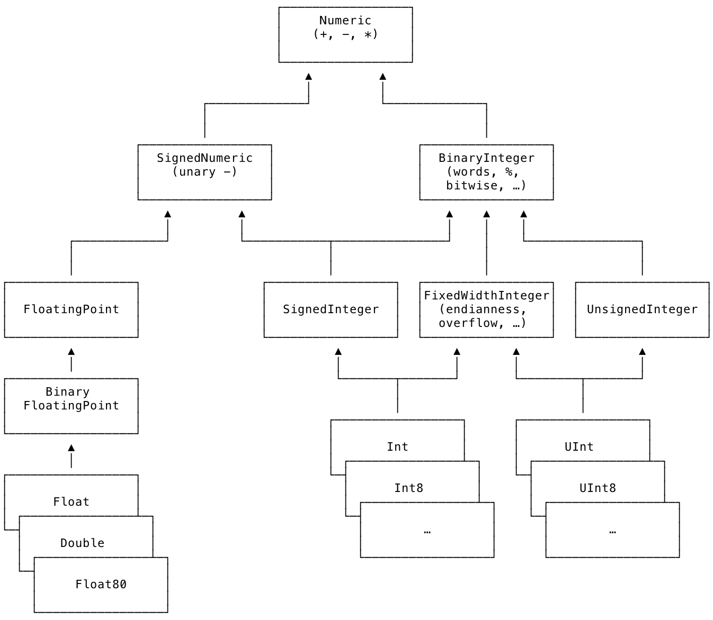

# Whats new in Swift 4

## 목차
1. 단방향 범위(Range) 표기
2. Strings
3. 접근제한자 : 한 파일안의 extension에서 private 제한자가 visible하게됨
4. Key paths
5. Encodings and decodings
6. Associated type constraints
7. Dictionary 와 Set 
8. MutableCollection.swapAt 함수
9. reduce with inout
10. Generic subscripts
11. New integer protocols
12. NSNumber bridging
13. Limiting @objc inference
14. Composing classes and protocols

## 단방향 범위(Range) 표기

[SE-0172][SE-0172] introduces a new `RangeExpression` protocol and a set of prefix/postfix operators to form one-sided ranges, i.e. ranges where either the lower or upper bound is unspecified.

[SE-0172]: https://github.com/apple/swift-evolution/blob/master/proposals/0172-one-sided-ranges.md "Swift Evolution Proposal SE-0172: One-sided Ranges"

### Infinite Sequences

 You can use a one-sided range to construct an infinite sequence, e.g. as a more flexible replacement for `enumerated()` when you don’t want the numbering to start at zero:
 
```swift
let letters = ["a","b","c","d"]
let numberedLetters = zip(1..., letters)
Array(numberedLetters)
```

### Collection subscripts

When you use a one-sided range for subscripting into a `Collection`, the collection’s `startIndex` or `endIndex` “fills in” the missing lower or upper bound, respectively.
 
```swift
let numbers = [1,2,3,4,5,6,7,8,9,10]
numbers[5...] // instead of numbers[5..<numbers.endIndex]
```

### Pattern Matching

One-sided ranges can be used in pattern matching constructs, e.g. in a `case` expression in a `switch` statement. Notice that the compiler can’t (yet?) determine that the `switch` is exhaustive, though.

```swift
let value = 5
switch value {
case 1...:
    print("greater than zero")
case 0:
    print("zero")
case ..<0:
    print("less than zero")
default:
    fatalError("unreachable")
}
```


## Strings

### Multi-line string literals : ```"""```

[SE-0168][SE-0168] introduces a simple syntax for multi-line string literals using three double-quotes (`"""`). Inside a multi-line string literal, you don’t need to escape a single double-quote, which means that most text formats (such as JSON or HTML) can be pasted in without any escaping. The indentation of the closing delimiter determines how much whitespace is stripped from the start of each line.

 [SE-0168]: https://github.com/apple/swift-evolution/blob/master/proposals/0168-multi-line-string-literals.md "Swift Evolution Proposal SE-0168: Multi-Line String Literals"

### Escaping newlines in string literals

[SE-0182][SE-0182] adds the ability to escape newlines in multi-line string literals with a backslash at the end of the line.

[SE-0182]: https://github.com/apple/swift-evolution/blob/master/proposals/0182-newline-escape-in-strings.md "Swift Evolution Proposal SE-0182: String Newline Escaping"

### String is a `Collection` again

[SE-0163][SE-0163] is the first part of the revised string model for Swift 4. The biggest change is that `String` is a `Collection` again (as it used to be in Swift 1.x), i.e. the functionality of `String.CharacterView` has been folded into the parent type. (The other views, `UnicodeScalarView`, `UTF8View`, and `UTF16View`, still exist.)

Another string-related change is a redesign of the `String.Index` type ([SE-0180][SE-0180])

[SE-0163]: https://github.com/apple/swift-evolution/blob/master/proposals/0163-string-revision-1.md "Swift Evolution Proposal SE-0163: String Revision: Collection Conformance, C Interop, Transcoding"
[SE-0180]: https://github.com/apple/swift-evolution/blob/master/proposals/0180-string-index-overhaul.md "Swift Evolution Proposal SE-0180: String Index Overhaul"

### `Substring` is the new type for string slices

String slices are now instances of type `Substring`. Both `String` and `Substring` conform to `StringProtocol`. Almost the entire string API will live in `StringProtocol` so that `String` and `Substring` behave largely the same.
```swift
let comma = greeting.index(of: ",")!
let substring = greeting[..<comma]
type(of: substring)
// Most String APIs can be called on Substring
print(substring.uppercased())
print("---")
```

A `Substring` keeps the full `String` value it was created from alive. This can lead to accidental high memory usage when you pass a seemingly small `Substring` that holds on to a large `String` to other API. For this reason, most functions that take a string as an argument should continue to accept only `String` instances; you generally should not make such functions generic to accept any value conforming to `StringProtocol`.

To convert a `Substring` back to a `String`, use a `String()` initializer. This will copy the substring into a new buffer:

```swift
let newString = String(substring)
type(of: newString)
```

[SE-0183](https://github.com/apple/swift-evolution/blob/master/proposals/0183-substring-affordances.md) changes a few standard library APIs to work on `StringProtocol` rather than `String`. The goal is to avoid unnecessary copies since these APIs are commonly used with slices of a string.

### Unicode 9
 
Swift 4 supports Unicode 9, fixing [some problems with proper grapheme clustering for modern emoji][Emoji 4.0]. All the character counts below are now correct (they weren’t in Swift 3):

[Emoji 4.0]: https://oleb.net/blog/2016/12/emoji-4-0/

```swift
"👧🏽".count // person + skin tone; in Swift 3: 2
"👨‍👩‍👧‍👦".count // family with four members; in Swift 3: 4
"👱🏾\u{200D}👩🏽\u{200D}👧🏿\u{200D}👦🏻".count // family + skin tones; in Swift 3: 8
"👩🏻‍🚒".count // person + skin tone + profession; in Swift 3: 3
"🇨🇺🇬🇫🇱🇨".count // multiple flags; in Swift 3: 1
```

### `Character.unicodeScalars` property
 
You can now access the code points of a `Character` directly without having to convert it to a `String` first ([SE-0178][SE-0178]):

[SE-0178]: https://github.com/apple/swift-evolution/blob/master/proposals/0178-character-unicode-view.md "Swift Evolution Proposal SE-0178: Add `unicodeScalars` property to `Character`"

```swift
let c: Character = "🇪🇺"
Array(c.unicodeScalars)
```

### Converting between `Range<String.Index>` and `NSRange`

Foundation comes with new initializers on `NSRange` and `Range<String.Index>` to convert between the two, removing the need to manually compute UTF-16 offsets. This makes it easier to use APIs that still work on `NSRange`s, such as `NSRegularExpression` and `NSAttributedString`.

```swift
// Given a String range
let string = "Hello 👩🏽‍🌾👨🏼‍🚒💃🏾"
let index = string.index(of: Character("👩🏽‍🌾"))!
let range = index...

// Convert the String range to an NSRange
import Foundation

let nsRange = NSRange(range, in: string)
nsRange.length // length in UTF-16 code units
string[range].count // length in Characters
assert(nsRange.length == string[range].utf16.count)

// Use the NSRange to format an attributed string
import UIKit

let formatted = NSMutableAttributedString(string: string, attributes: [.font: UIFont.systemFont(ofSize: 14)])
formatted.addAttribute(.font, value: UIFont.systemFont(ofSize: 48), range: nsRange)

// NSAttributedString APIs return NSRange
let lastCharacterIndex = string.index(before: string.endIndex)
let lastCharacterNSRange = NSRange(lastCharacterIndex..., in: string)
var attributesNSRange = NSRange()
_ = formatted.attributes(at: lastCharacterNSRange.location, longestEffectiveRange: &attributesNSRange, in: nsRange)
attributesNSRange

// Convert the NSRange back to Range<String.Index> to use it with String
let attributesRange = Range(attributesNSRange, in: string)!
string[attributesRange]
```

## 접근제한자 : 한 파일안의 extension에서 private 제한자가 visible하게됨

[SE-0169][SE-0169] changes the access control rules such that `private` declarations are also visible inside extensions of the parent type _in the same file_. This makes it possible to split your type definition into multiple extensions and still use `private` for most "private" members, reducing the need for the unloved `fileprivate` keyword.

[SE-0169]: https://github.com/apple/swift-evolution/blob/master/proposals/0169-improve-interaction-between-private-declarations-and-extensions.md "Swift Evolution Proposal SE-0169: Improve Interaction Between private Declarations and Extensions"

## Key paths
One of the headline features of Swift 4 is the new key paths model described in [SE-0161][SE-0161]. Unlike the string-based key paths in Cocoa, Swift key paths are strongly typed.

[SE-0161]: https://github.com/apple/swift-evolution/blob/master/proposals/0161-key-paths.md "Swift Evolution Proposal SE-0161: Smart KeyPaths: Better Key-Value Coding for Swift"

Key paths are formed by starting at a root type and drilling down any combination of property and subscript names.

You write a key path by starting with a backslash: `\Book.title`. Every type automatically gets a `[keyPath: …]` subscript to get or set the value at the specified key path.

Key paths are objects that can be stored and manipulated. For example, you can append additional segments to a key path to drill down further.

### Type-safe KVO with key paths

The key-value observing API in Foundation has been revamped to take full advantage of the new type-safe key paths. It is much easier to use than the old API.

Notice that KVO depends on the Objective-C runtime. It only works in subclasses of `NSObject`, and any observable property must be declared with `@objc dynamic`.

## Archival and serialization

[SE-0166: Swift Archival & Serialization][SE-0166] defines a way for any Swift type (classes, structs, and enums) to describe how to archive and serialize itself. Types can make themselves (un-)archivable by conforming to the `Codable` protocol.

In many cases adding the `Codable` conformance will be all you have to do for your custom types because the compiler can generate a default implementation if all of the types’ members are themselves `Codable`. You can also override the default behavior if you need to customize how your type encodes itself. There is a lot to this topic — make sure to read the proposal for details.

[SE-0166]: https://github.com/apple/swift-evolution/blob/master/proposals/0166-swift-archival-serialization.md "Swift Evolution Proposal SE-0166: Swift Archival & Serialization"

```swift
// Make a custom type archivable by conforming it (and all its members) to Codable
struct Card: Codable, Equatable {
    enum Suit: String, Codable {
        case clubs, spades, hearts, diamonds
    }

    enum Rank: Int, Codable {
        case two = 2, three, four, five, six, seven, eight, nine, ten, jack, queen, king, ace
    }

    var suit: Suit
    var rank: Rank

    static func ==(lhs: Card, rhs: Card) -> Bool {
        return lhs.suit == rhs.suit && lhs.rank == rhs.rank
    }
}

let hand = [Card(suit: .clubs, rank: .ace), Card(suit: .hearts, rank: .queen)]
```

### Encoding
 
 Once you have a `Codable` value, you need to pass it to an encoder in order to archive it.
 
 You can write your own encoders and decoders that make use of the `Codable` infrastructure, but Swift will also come with a built-in set of encoders and decoders for JSON (`JSONEncoder` and `JSONDecoder`) and property lists (`PropertyListEncoder` and `PropertyListDecoder`). These are defined in [SE-0167][SE-0167]. `NSKeyedArchiver` will also support all `Codable` types.

[SE-0167]: https://github.com/apple/swift-evolution/blob/master/proposals/0167-swift-encoders.md "Swift Evolution Proposal SE-0167: Swift Encoders"

In its simplest form, encoding is just two lines of code: create and encoder and ask it to encode your value. Most encoders include properties you can set to customize the output.

```swift
import Foundation

var encoder = JSONEncoder()

// Optional properties offered by JSONEncoder for customizing output
encoder.outputFormatting = [.prettyPrinted] // another option: .sortedKeys
encoder.dataEncodingStrategy
encoder.dateEncodingStrategy
encoder.nonConformingFloatEncodingStrategy

// Every encoder and decoder has a userInfo property to pass custom configuration down the chain. The supported keys depend on the specific encode/decoder.
encoder.userInfo

let jsonData = try encoder.encode(hand)
String(data: jsonData, encoding: .utf8)
```

### Decoding

Like encoding, decoding consists of two steps: create a decoder and pass it a `Data` value to decode. Notice that you also pass the expected type of the decoded value (`[Card]`, or `Array<Card>`, in this example). Don’t forget to handle decoding errors in production code.

```swift
let decoder = JSONDecoder()
let decodedHand = try decoder.decode([Card].self, from: jsonData)
type(of: decodedHand)
assert(decodedHand == hand)
```
## Associated type constraints

[SE-0142][SE-0142]: associated types in protocols can now be constrained with `where` clauses. This seemingly small change makes the type system much more expressive and facilitates a significant simplification of the standard library. In particular, working with `Sequence` and `Collection` is a lot more intuitive in Swift 4.

[SE-0142]: https://github.com/apple/swift-evolution/blob/master/proposals/0142-associated-types-constraints.md "Swift Evolution Proposal SE-0142: Permit where clauses to constrain associated types"

### `Sequence.Element`

`Sequence` now has its own `Element` associated type. This is made possible by the new generics feature because `associatedtype Element where Element == Iterator.Element` can now be expressed in the type system.

Anywhere you had to write `Iterator.Element` in Swift 3, you can now just write `Element`:

```swift
extension Sequence where Element: Numeric {
    var sum: Element {
        var result: Element = 0
        for element in self {
            result += element
        }
        return result
    }
}

[1,2,3,4].sum
```

Another example: In Swift 3, this extension required more constraints because the type system could not express the idea that the elements of `Collection`’s associated `Indices` type had the same type as `Collection.Index`:


   // Required in Swift 3
   extension MutableCollection where Index == Indices.Iterator.Element {

```swift
extension MutableCollection {
    /// Maps over the elements in the collection in place, replacing the existing
    /// elements with their transformed values.
    mutating func mapInPlace(_ transform: (Element) throws -> Element) rethrows {
        for index in indices {
            self[index] = try transform(self[index])
        }
    }
}
```


## More generics features

Two more important generics improvements have been accepted for Swift 4, but aren’t implemented yet:

* [SE-0143 Conditional protocol conformances][SE-0143]
* [SE-0157 Recursive protocol constraints][SE-0157]

[SE-0143]: https://github.com/apple/swift-evolution/blob/master/proposals/0143-conditional-conformances.md
[SE-0157]: https://github.com/apple/swift-evolution/blob/master/proposals/0157-recursive-protocol-constraints.md

## `Dictionary` and `Set` enhancements

[SE-0165][SE-0165] adds several nice enhancements to `Dictionary` and `Set`.

[SE-0165]: https://github.com/apple/swift-evolution/blob/master/proposals/0165-dict.md "Swift Evolution Proposal SE-0165: Dictionary and Set Enhancements"

### Sequence-based initializer

Create a dictionary from a sequence of key-value pairs.
```swift
let names = ["Cagney", "Lacey", "Bensen"]
let dict = Dictionary(uniqueKeysWithValues: zip(1..., names))
dict[2]
```

### Merging initializer and `merge` method

Specify how duplicate keys should be handled when creating a dictionary from a sequence or merging a sequence into an existing dictionary.

Merging initializer:

```swift
let duplicates = [("a", 1), ("b", 2), ("a", 3), ("b", 4)]
let letters = Dictionary(duplicates, uniquingKeysWith: { (first, _) in first })
letters
```

`merge` method:

```swift
let defaults = ["darkUI": false, "energySaving": false, "smoothScrolling": false]
var options = ["darkUI": true, "energySaving": false]
options.merge(defaults) { (old, _) in old }
options
```

### Subscript with default value

You can provide a default value that will be returned for missing keys as a subscript argument, making the return type non-optional.
```swift
dict[4, default: "(unknown)"]
```

This is especially useful when you want to mutate a value through the subscript:

```swift
let source = "how now brown cow"
var frequencies: [Character: Int] = [:]
for c in source {
    frequencies[c, default: 0] += 1
}
frequencies
```

### Dictionary-specific `map` and `filter`

`filter` returns a `Dictionary` and not an `Array`. Similarly, the new `mapValues` method transforms the values while preserving the dictionary structure.

```swift
let filtered = dict.filter {
    $0.key % 2 == 0
}
type(of: filtered)

let mapped = dict.mapValues { value in
    value.uppercased()
}
mapped
```

`Set.filter` also returns a `Set` now and not an `Array`.

```swift
let set: Set = [1,2,3,4,5]
let filteredSet = set.filter { $0 % 2 == 0 }
type(of: filteredSet)
filteredSet
```

### Grouping a sequence

Group a sequence of values into buckets, e.g. partition words in a word list by their initial letter. This is one of my favorites.

```swift
let contacts = ["Julia", "Susan", "John", "Alice", "Alex"]
let grouped = Dictionary(grouping: contacts, by: { $0.first! })
grouped
```

## `MutableCollection.swapAt` method

[SE-0173][SE-0173] introduces a new method for swapping two elements in a collection. Unlike the existing `swap(_:_:)` function, `swapAt(_:_:)` takes the indices of the elements to be swapped, not the elements themselves (via `inout` arguments).
 
The reason for this addition is that `swap` with two `inout` arguments is incompatible with the new exclusive memory access rules proposed in [SE-0176][SE-0176]. The existing `swap(_:_:)` function will no longer work for swapping two elements of the same collection.

[SE-0173]: https://github.com/apple/swift-evolution/blob/master/proposals/0173-swap-indices.md "Swift Evolution Proposal SE-0173: Add `MutableCollection.swapAt(_:_:)`"
[SE-0176]: https://github.com/apple/swift-evolution/blob/master/proposals/0176-enforce-exclusive-access-to-memory.md "Swift Evolution Proposal SE-0176: Enforce Exclusive Access to Memory"

```swift
var numbers = [1,2,3,4,5]

// Illegal in Swift 4:
// error: simultaneous accesses to var 'numbers', but modification requires exclusive access; consider copying to a local variable
//swap(&numbers[3], &numbers[4])

// This is the new way to do this:
numbers.swapAt(0,1)
numbers
```

## `reduce` with `inout`

[SE-0171][SE-0171] adds a variant of `reduce` in which the partial result is passed `inout` to the combine function. This can be a significant performance boost for algorithms that use `reduce` to incrementally build a sequence by eliminating copies of the intermediate results.

[SE-0171]: https://github.com/apple/swift-evolution/blob/master/proposals/0171-reduce-with-inout.md "Swift Evolution Proposal SE-0171: Reduce with `inout`"

```swift
extension Sequence where Element: Equatable {
    func removingConsecutiveDuplicates() -> [Element] {
        return reduce(into: []) { (result: inout [Element], element) in
            if result.last != element {
                result.append(element)
            }
        }
    }
}

[1,1,1,2,3,3,4].removingConsecutiveDuplicates()
```

## Generic subscripts

Courtesy of [SE-0148][SE-0148], subscripts can now have generic arguments and/or return types.

[SE-0148]: https://github.com/apple/swift-evolution/blob/master/proposals/0148-generic-subscripts.md "Swift Evolution Proposal SE-0148: Generic Subscripts"

The canonical example is a type that represents JSON data: you can define a generic subscript to have the caller’s context define the expected return type.

```swift
struct JSON {
    fileprivate var storage: [String:Any]

    init(dictionary: [String:Any]) {
        self.storage = dictionary
    }

    subscript<T>(key: String) -> T? {
        return storage[key] as? T
    }
}

let json = JSON(dictionary: [
    "name": "Berlin",
    "country": "de",
    "population": 3_500_500
    ])

// No need to use as? Int
let population: Int? = json["population"]
```

Another example: a subscript on `Collection` that takes a generic sequence of indices and returns an array of the values at these indices:

```swift
extension Collection {
    subscript<Indices: Sequence>(indices indices: Indices) -> [Element] where Indices.Element == Index {
        var result: [Element] = []
        for index in indices {
            result.append(self[index])
        }
        return result
    }
}

let words = "Lorem ipsum dolor sit amet".split(separator: " ")
words[indices: [1,2]]
```

## New integer protocols

[SE-0104][SE-0104] was originally accepted for Swift 3, but didnʼt make it in then. Now a slightly revised version is coming in Swift 4. “This proposal cleans up Swifts integer APIs and makes them more useful for generic programming.”

[SE-0104]: https://github.com/apple/swift-evolution/blob/master/proposals/0104-improved-integers.md "Swift Evolution Proposal SE-0104: Protocol-oriented integers"

The protocol hierarchy looks like this:



This might look a little intimidating, but the most important thing to take away from this is that you don’t have to care about all the protocols. Just use the integer types you’re familiar with, such as `Int` and `UInt8`, as you always have and you’ll be absolutely fine. The new protocols only come into play once you want to write generic algorithms that work on multiple numeric types.

For a library that takes advantage of the new protocols, check out [NumericAnnex](https://github.com/xwu/NumericAnnex) by Xiaodi Wu.

### Heterogeneous comparison operators

You can now compare an `Int` to an `UInt` without explicit conversion, thanks to new generic overloads for these functions in the standard library.

```swift
let a: Int = 5
let b: UInt = 5
let c: Int8 = -10
a == b // doesn't compile in Swift 3
a > c  // doesn't compile in Swift 3
```

 Note that mixed-type _arithmetic_ doesn’t work because Swift doesn’t have a concept of _promoting_ one type to another yet. (The implicit promotion of `T` to `Optional<T>` is an exception, hardcoded into the compiler.) This is a desirable feature for a future version.

```swift
//a + b // doesn't compile in either Swift 3 or 4
```

There’s a lot more to the new protocols. Here are a few examples of new properties and methods:

```swift
// Get information about the bit pattern
0xFFFF.words
0b11001000.trailingZeroBitCount
(0b00001100 as UInt8).leadingZeroBitCount
0b110001.nonzeroBitCount

// Artihmetic with overflow reporting
let (partialValue, overflow) = Int32.max.addingReportingOverflow(1)
partialValue
overflow

// Calculate the full result of a multiplication that would otherwise overflow
let x: UInt8 = 100
let y: UInt8 = 20
let result = x.multipliedFullWidth(by: y)
result.high
result.low
```

I left out some more additions, such as new bit shifting operators and semantics. Read the proposal to get the full picture.

### `DoubleWidth`

The new `DoubleWidth<T>` type is supposed to make it possible to create wider fixed-width integer types from the ones available in the standard library. It's implemented in the Swift master branch, but isn't included in Swift 4.0. Expect it to be part of the next point release.

```swift
//var veryBigNumber = DoubleWidth<Int64>(Int64.max) // error: Use of unresolved identifier 'DoubleWidth'
//veryBigNumber + 1
```

## `NSNumber` bridging

[SE-0170][SE-0170] fixes some dangerous behavior when bridging between native Swift number types and `NSNumber`.

[SE-0170]: https://github.com/apple/swift-evolution/blob/master/proposals/0170-nsnumber_bridge.md "Swift Evolution Proposal SE-0170: NSNumber bridging and Numeric types"

```swift
import Foundation

let n = NSNumber(value: UInt32(543))
let v = n as? Int8 // nil in Swift 4. This would be 31 in Swift 3 (try it!).
```

### Floating-point `NSNumber` bridging

Initially, in Xcode 9 beta 1, the same rules applied to floating-point bridging, which meant for example that `NSNumber(value: 0.1) as? Float` would return `nil` because the double-precision representation of `0.1` is not exactly representable as a single-precision float. [This change was reverted to the Swift 3 behavior](https://lists.swift.org/pipermail/swift-evolution/Week-of-Mon-20170612/037499.html).

```swift
NSNumber(value: 0.1) as? Double
NSNumber(value: 0.1) as? Float // Returned nil in Xcode 9 beta 1, now changed back to Swift 3 behavior
```

## Limiting `@objc` inference

In many places where Swift 3 automatically inferred a declaration to be `@objc` (and thus visible from Objective-C), Swift 4 doesn’t do this anymore ([SE-0160][SE-0160]). Most importantly, `NSObject` subclasses no longer infer `@objc` for their members.

[SE-0160]: https://github.com/apple/swift-evolution/blob/master/proposals/0160-objc-inference.md "Swift Evolution Proposal SE-0160: Limiting @objc inference"

```swift
import Foundation

class MyClass : NSObject {
    func foo() { }       // not exposed to Objective-C in Swift 4
    @objc func bar() { } // explicitly exposed to Objective-C
}
```

### `@objcMembers` shorthand

If want to expose all or most members of a class to Objective-C, you can use the `@objcMembers` attribute on the class declaration to save you some typing:

```swift
@objcMembers
class MyClass2 : NSObject {
    func foo() { }             // implicitly @objc
    func bar() -> (Int, Int) { // not @objc, because tuples aren't representable in Objective-C (unchanged from Swift 3)
        return (0, 0)
    }
}
```

Use `@nonobjc` on an extension to disable `@objc` inference (through `@objcMembers`) for all declarations in the extension.
```swift
@nonobjc extension MyClass2 {
    func wobble() { } // not @objc, despite @objcMembers
}
```

### `dynamic` doesn’t imply `@objc`

Also note that `dynamic` doesn’t imply `@objc` anymore. If you want to use features that depend on the dynamic dispatch of the Objective-C runtime (such as KVO), you may need to add `@objc dynamic` to a declaration. See the [Key paths page](Key%20paths) for a KVO example.

Since `dynamic` is currently implemented in terms of the Objective-C runtime, this means all current usages of `dynamic` also have to be `@objc`. While this sounds redundant at the moment, it’s an important step on the way to eventually make `dynamic` a pure Swift feature in a future version of the language.

## Composing classes and protocols

[SE-0156][SE-0156]: You can now write the equivalent of the Objective-C code `UIViewController <SomeProtocol> *` in Swift, i.e. declare a variable of a concrete type and constrain it to one or more protocols at the same time. The syntax is `let variable: SomeClass & SomeProtocol1 & SomeProtocol2`.

[SE-0156]: https://github.com/apple/swift-evolution/blob/master/proposals/0156-subclass-existentials.md "Swift Evolution Proposal SE-0156: Class and Subtype existentials"

```swift
import UIKit

protocol HeaderView {}

class ViewController: UIViewController {
    let header: UIView & HeaderView

    init(header: UIView & HeaderView) {
        self.header = header
        super.init(nibName: nil, bundle: nil)
    }

    required init(coder decoder: NSCoder) {
        fatalError("not implemented")
    }
}

// Can't pass in a simple UIView that doesn't conform to the protocol
//ViewController(header: UIView())
// error: argument type 'UIView' does not conform to expected type 'UIView & HeaderView'

// Must pass in an NSView (subclass) that also conforms to the protocol
extension UIImageView: HeaderView {}

ViewController(header: UIImageView()) // works
```


